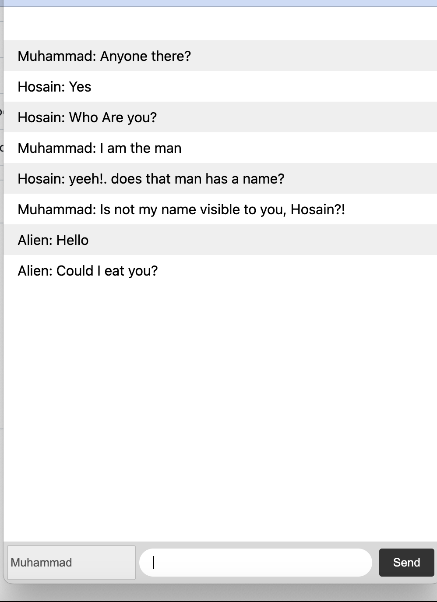

# Chat App

This is a simple chat app that allows users to communicate with each other in real-time.

## Features
- Real-time messaging

## Installation

1. Clone the repository:

    ```bash
    git clone https://github.com/MuhammadElsaeed/chat-app.git
    ```

2. Install the dependencies:

    ```bash
    npm install
    ```

3. Start the development server:

    ```bash
    npm start
    ```

## Usage

1. Open your web browser and navigate to `http://localhost:3000`.
2. Start chatting with other users in real-time!

## Screenshots


